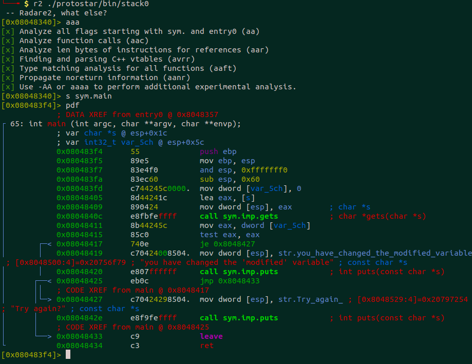
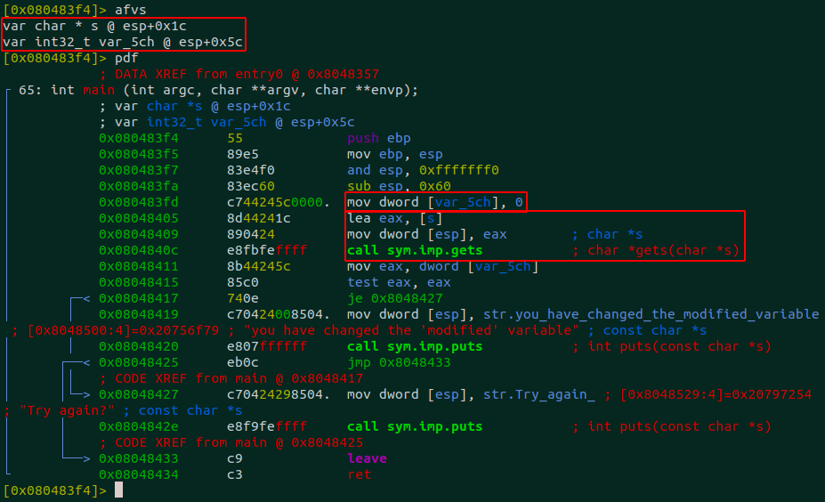
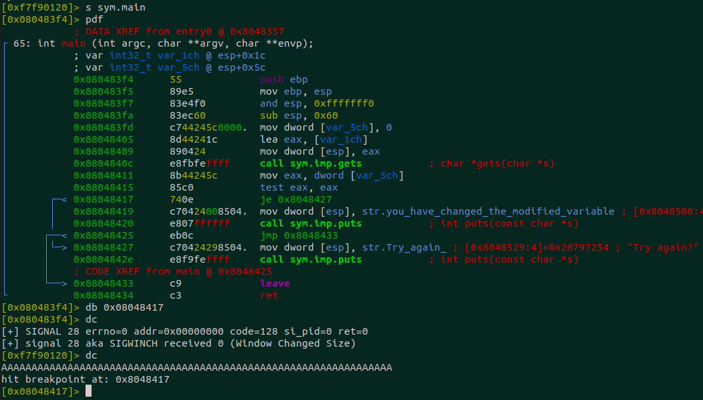

# stack0
Here is the source code
```c
#include <stdlib.h>
#include <unistd.h>
#include <stdio.h>

int main(int argc, char **argv)
{
  volatile int modified;
  char buffer[64];

  modified = 0;
  gets(buffer);

  if(modified != 0) {
      printf("you have changed the 'modified' variable\n");
  } else {
      printf("Try again?\n");
  }
}
```

And here is the disassembled code using radare2


To pass this level the `modified` variable should be non-zero and as we see in the code this variable gets a zero value and never changes in the code\
As we know we should overflow the `buffer` with more than 64 char size input and overwrite the `modified` variable to non-zero value to pass this level\
Let's see how much character we should overflow to reach and modify the `modified` variable


If we look at the assemby code we see that the `var_5ch` is modified variable according to this line:
```
mov dword [var_5ch], 0
```
ans also the `s` variable is actually the  64 char`buffer` because of these lines
```
lea eax, [s]
mov dword [esp], eax
call sym.imp.gets
```
It loads `s` address into `eax` the moves `eax` to top of the stack (`esp`) and call the `gets`\
So between the `buffer` and `s` There is actually 64 bytes so if we give a value of 65 `A` characters 64 bytes of them fits the `buffer` and the last one will replace in `modified` variable which will pass this level

Let's give it a try


OK we passed this level0 stack wih just simply overflowing the buffer and overwriting the `modified` variable to non-zero value